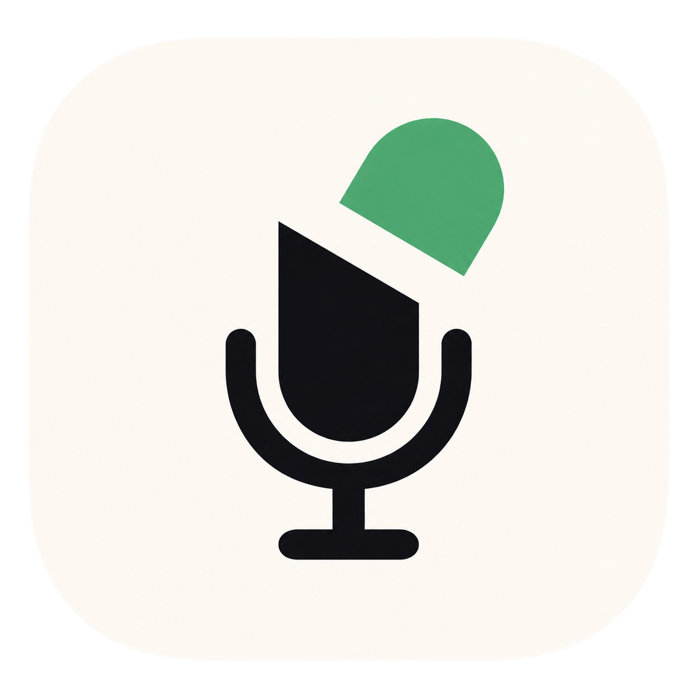
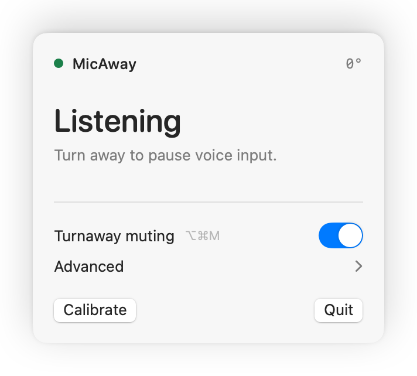
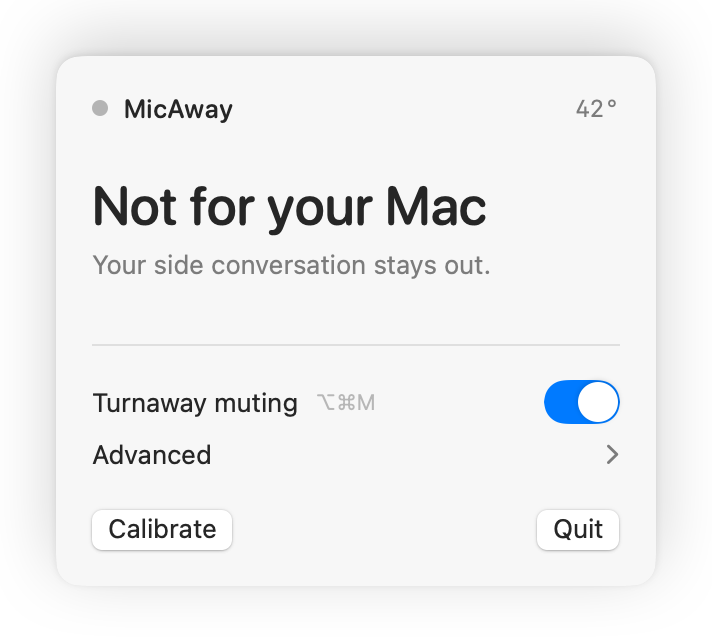

<p align="center">
  
</p>

<h1 align="center">MicAway</h1>

<p align="center"><strong>Not every word is a prompt.</strong></p>

<p align="center">
  The open-source attention layer for continuous voice on macOS. Look away to keep a side conversation out; face your Mac to continue.
</p>

<p align="center">
  <a href="https://github.com/akashp1712/micaway/releases/latest"><strong>Download the developer preview</strong></a>
  ·
  <a href="apps/mac/README.md">How it works</a>
  ·
  <a href="https://github.com/akashp1712/micaway/issues/new?template=compatibility-report.yml">Report compatibility</a>
</p>

<p align="center">
  
  
  
  <a href="LICENSE"></a>
</p>

<p align="center">
  
</p>

<p align="center">
  
  &nbsp;
  
</p>

> [!IMPORTANT]
> **Version 0.5.2 is a universal developer preview** (Apple silicon + Intel), ad-hoc signed but not yet Developer ID signed or notarized. It is free to download and audit, but macOS will ask you to approve the first launch. Notarized distribution can come later; the source and behavior are available now.

## The problem

Voice-first work is fast—until “yes, I’ll be there in five” lands in the middle of your prompt.

MicAway turns attention into a physical microphone boundary:

- face your Mac to speak;
- turn toward someone nearby and your available input devices mute;
- face back and MicAway restores only the inputs it muted.
- limit automatic muting to selected dictation apps, keeping meeting apps untouched;
- pause turnaway muting while carrying or repositioning your Mac, then resume from a safely re-centered position.

No wake word. No audio processing. ⌥⌘M pauses or resumes MicAway.

## Voice-app compatibility

MicAway acts on writable macOS input devices, so it is not tied to one dictation app. A voice app must be using a physical input that macOS allows MicAway to mute.

| Voice app | Status | Use case |
| --- | --- | --- |
| **FluidVoice** | ✅ Manually verified | Keep local dictation clean while briefly speaking to someone nearby. |
| **Wispr Flow** | 🧪 Community test wanted | Prevent an aside from entering fast, system-wide dictation. |
| **ChatGPT Voice** | 🧪 Community test wanted | Pause your microphone naturally during a voice conversation. |

If you test another Mac, AirPods model, or voice app, open a [compatibility report](https://github.com/akashp1712/micaway/issues/new?template=compatibility-report.yml). Please never paste private dictated text into an issue.

## Compatibility

| What | Supported |
| --- | --- |
| **macOS** | 14 (Sonoma) or newer. `CMHeadphoneMotionManager` sets this floor. |
| **Mac chips** | Universal binary. Apple silicon — M1, M1 Pro/Max/Ultra, M2, M3, M4 (all variants) — natively, plus Intel Macs. |
| **AirPods (head tracking)** | AirPods Pro (1st & 2nd gen), AirPods (3rd & 4th gen), AirPods Max. Any AirPods with dynamic head tracking work; MicAway degrades gracefully on models without it. |
| **Without AirPods** | No head tracking. Use the voice app's normal mute control. |

Head-tracking availability can still vary by AirPods generation, connection
state, and macOS behavior. If a combination behaves differently, please file a
[compatibility report](https://github.com/akashp1712/micaway/issues/new?template=compatibility-report.yml).

## Install the preview

1. Download `MicAway-0.5.2-universal.zip` from the [latest release](https://github.com/akashp1712/micaway/releases/latest) and, optionally, verify it against `MicAway-0.5.2-universal.sha256` with `shasum -a 256 -c MicAway-0.5.2-universal.sha256`.
2. Unzip it and move `MicAway.app` to **Applications**.
3. Try to open MicAway. If macOS blocks it, open **System Settings → Privacy & Security**, scroll to **Security**, choose **Open Anyway**, and confirm **Open**.
4. If macOS still refuses to open the unsigned preview, run the following commands in Terminal:

   ```bash
   xattr -cr "/Applications/MicAway.app"
   open "/Applications/MicAway.app"
   ```

   > [!WARNING]
   > Run this only for `MicAway.app` downloaded from the [official GitHub release](https://github.com/akashp1712/micaway/releases/latest). It removes quarantine metadata from MicAway only. Never run it against your entire Applications or Downloads folder, and never replace the app path with a wildcard.

5. Put compatible AirPods in both ears, allow **Motion** access when macOS asks, face your Mac, and select **Calibrate**.

Then tune it to how you work:

- **Turnaway muting** is the master switch (`⌥⌘M`). Switch it off while moving around; switching it back on re-centers to your current position before automatic muting resumes.
- **Advanced → Use in** can apply automatic muting in every app or only selected apps. To add an app, bring it forward, open MicAway, choose **Selected apps**, then choose **Allowed apps → Add _App Name_**. If any unselected app is also using the microphone, automatic muting stays safely inactive.
- **Advanced → Sensitivity** (Low / Medium / High) sets how far you can turn before the mic mutes. Medium is the default (mute past ~45°, restore under ~28°); Low tolerates a bigger turn, High reacts to a smaller one.

MicAway lives in the menu bar. It runs on macOS 14 or newer and is a universal binary — native on Apple silicon (M1–M4) and Intel Macs.

MicAway does **not** request Microphone or Accessibility access. It reads AirPods motion locally and changes writable input-device mute state through Core Audio; it does not listen to or control your Mac through Accessibility APIs.

Use the normal mute control in your voice or meeting app whenever you need a deliberate mute. MicAway restores only input devices it muted itself, so it does not undo a mute that was already active elsewhere.

## Privacy by construction

MicAway does not request microphone permission because it never listens to your microphone.

- no audio recording or transcription;
- no analytics or account;
- no network service;
- calibration stays on your Mac;
- the source is small enough to inspect.

It reads head direction from supported AirPods and changes the mute state of available input devices through macOS audio APIs.

## Build from source

Requirements: macOS 14+, Xcode Command Line Tools, and Swift 5.10 or newer.

```bash
git clone https://github.com/akashp1712/micaway.git
cd micaway/apps/mac
./scripts/build-app.sh      # universal arm64 + x86_64 .app in dist/
open "dist/MicAway.app"
```

Run the tests with:

```bash
cd apps/mac
./scripts/test.sh
```

`test.sh` runs the canonical swift-testing suite via SwiftPM when the toolchain is healthy, and otherwise falls back to a standalone `swiftc`-compiled runner that mirrors the same assertions — useful when a Command Line Tools install leaves `swift test` broken with `Invalid manifest … PackageDescription.Package.__allocating_init`.

Package the universal release archive and checksum with:

```bash
cd apps/mac
./scripts/package-release.sh 0.5.2
```

## Repository map

```text
apps/mac/   Swift menu-bar app, motion tracking, and tests
apps/web/   MicAway landing page
```

## Known limits

- Compatible AirPods and Motion access are required for head tracking.
- The downloadable build is universal (Apple silicon + Intel) but ad-hoc signed, not Developer ID signed or notarized.
- A voice app using a non-mutable virtual microphone may need a future MicAway virtual-input mode.
- Selected Apps works at the macOS application level, not at the individual browser-tab level.
- Headphone motion availability can vary by AirPods generation, connection state, and macOS behavior.

## Contributing

Bug reports, compatibility results, accessibility improvements, and focused pull requests are welcome. Start with [CONTRIBUTING.md](CONTRIBUTING.md), and read [SECURITY.md](SECURITY.md) before reporting a vulnerability.

## License

MicAway is available under the [MIT License](LICENSE). © 2026 Akash Panchal.

MicAway is an independent open-source project and is not affiliated with or endorsed by Wispr Flow, FluidVoice, OpenAI, or Apple. Product names and logos belong to their respective owners.
